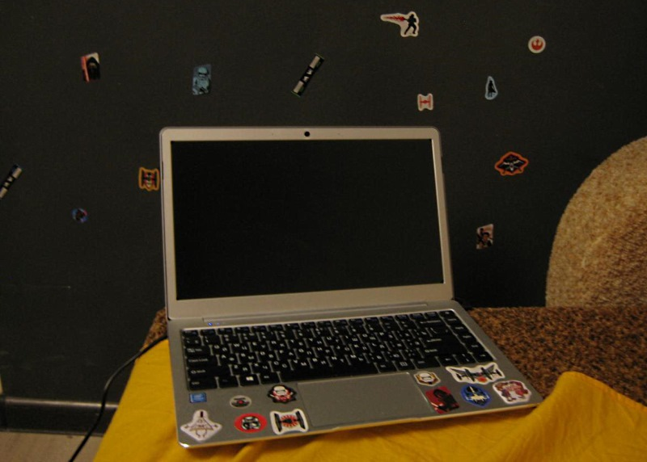
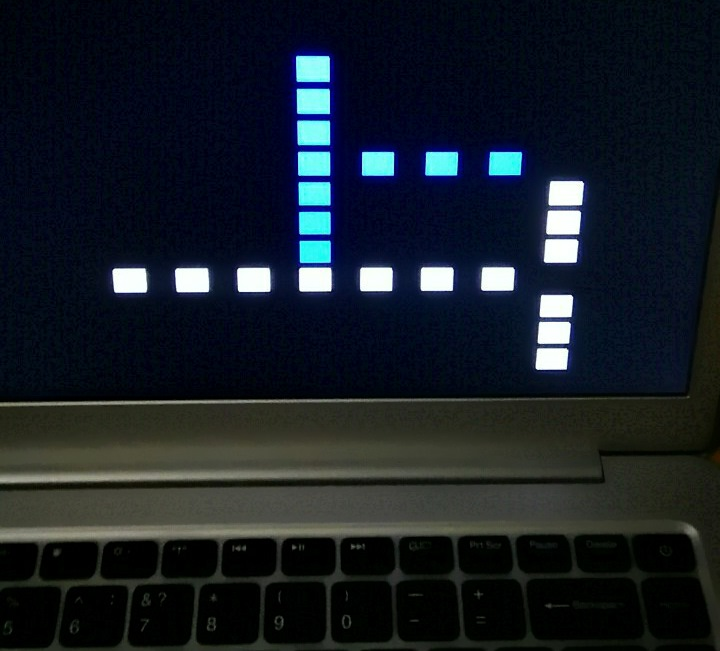

Great news! Recently we have updated [Greentea homepage](https://greenteaos.github.io) with a [blog](https://greenteaos.github.io/blog) feature, so now you will see per-week news and reports. Pretty often, but stimulating progress and openness to the community.

Main testing device is now an Apollo Lake laptop. It has tricky firmware, so booting Greentea takes some effort (which is actually good for testing purposes). Previous device was Sandy Bridge PC but it just werks and boring, and eventually died with yet another Windows update. Thanks Microsoft for wiping BIOS!

### Test and debug

Debugging bootloader this way is not productive, so I will add text output into boot stage.

After fixing testing laptop, we will find out a better memory layout for ACPI. ACPI contains information about all useful hardware on your computer, like PCI devices, event timers, CPU cores, etc. But the trick is ACPI and PCI memory is spread randomly across physical RAM address space, so it's a bit annoying to deal with. We have an idea how map whole physical RAM into virtual address range, which works great on small RAM amount (<2Gb) but it's hard to map more memory (>16Gb) without memory manager improvements (sorta "huge pages").

### Hardware and software

Next step is to port .exe-loader works into kernel. First, into kernel mode, to see how it goes and ensure win32 basics works. Then move on to user space and multitasking.

Having ACPI will also open opportunities to create PCI device drivers, and we have lots of references how to do that from other osdev projects. As for the storage - NVMe may be easier to implement than SATA, especially being supported on VirtualBox, and I have actual NVMe device to test.

Stay in touch following our [community links](https://greenteaos.github.io/wiki/community.html). And subscribe to the [YouTube channel](https://www.youtube.com/channel/UChcz5b20vDOk4ERoPs-pCbw/featured) for upcoming videos.
